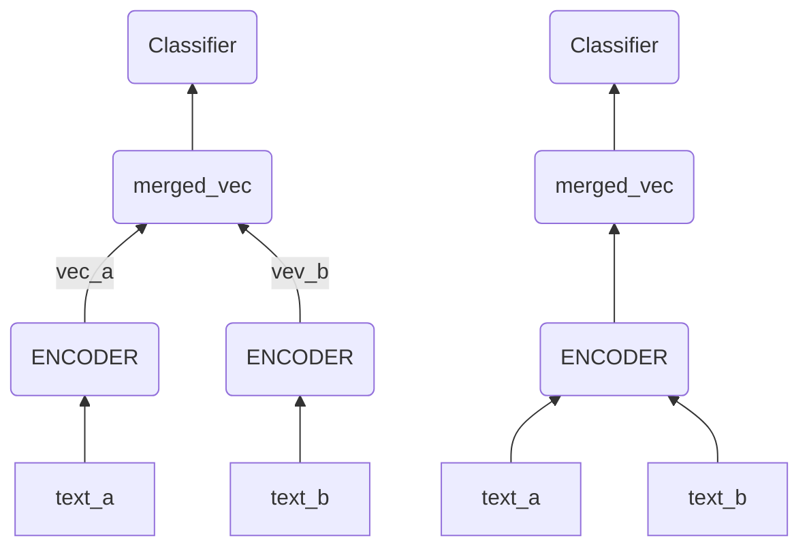

# Text Matching

在深度学习中，文本匹配模型可以分成两种结构：**双塔式**和**交互式**

1. 双塔式：也称孪生网络，Representation-based，其实就是用一个Encoder分别给两个文本编码出句向量，然后把这两个句向量融合，然后过一个浅层的分类器
2. 交互式：也称Interaction-Based，就是把两个文本一起输入进Encoder，让这两个文本一起在Encoder中相互交换信息，再得到最终的结果

> 1. 通常双塔式的速度会快很多，因为候选可以提前计算好，只用将Query编码后再去和候选向量进行浅层计算就好了
> 2. 通常交互式的准确率会高一些，因为Encoder能够使用的信息更多了
>
> 工程落地中，通常使用双塔式来做召回，然后在对召回的候选进行更精细的计算。所以上述两种方式在实际应用中都必不可缺

## 双塔式模型

双塔式模型通常有三个点可以优化：Encoder，Merged_vec和Classifier。大部分研究都在专注提升Encoder的能力

### DSSM

简要：通过构建user和item两个独立的子网络，将训练好的两个‘塔’中的user embedding和item embedding各自缓存到内存数据库中。线上预测的时候只需要在内存中进行相似度运算即可

## 交互式模型

交互式模型的核心思想是将两个句子逐个词进行比较

# 参考

1. [21个经典深度学习句间关系模型｜代码&技巧](https://zhuanlan.zhihu.com/p/357864974)
2. [广告行业中那些趣事系列10：推荐系统中不得不说的DSSM双塔模型](https://zhuanlan.zhihu.com/p/139541282)

